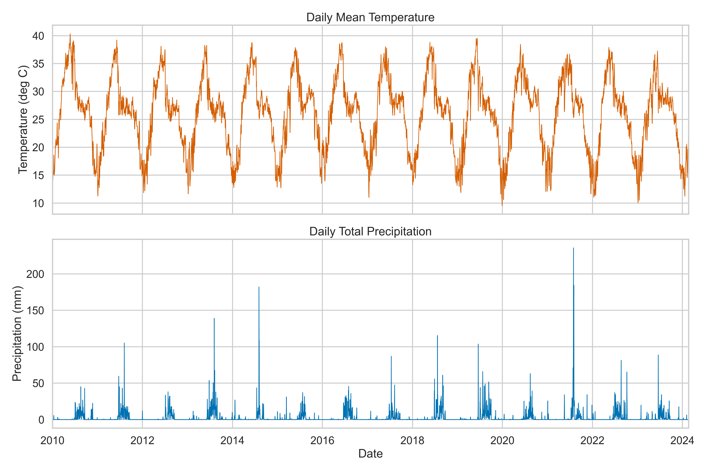
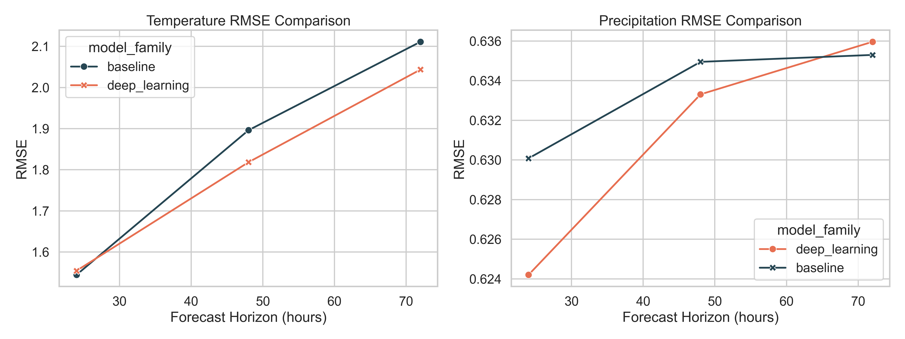
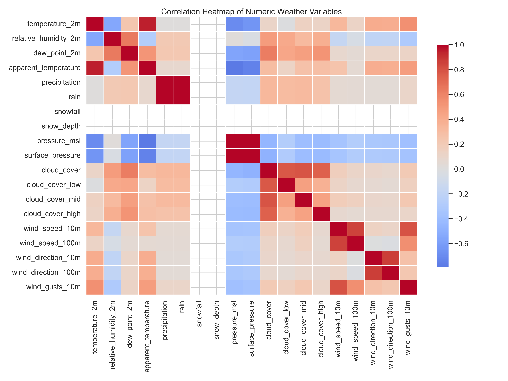
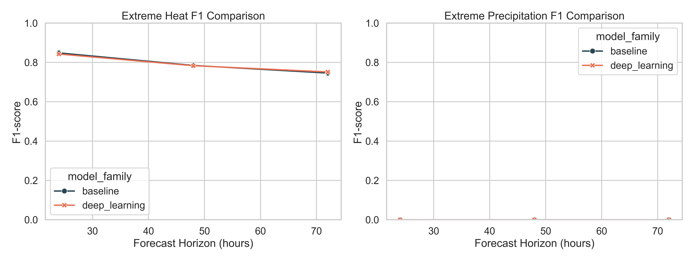
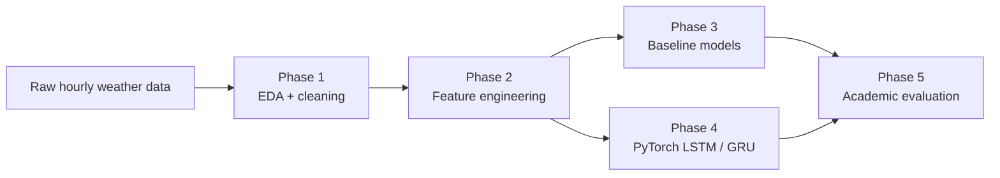

# Climate Change Adaptation: Localized Micro-Climate Forecasting

This repository presents an end-to-end academic machine learning project for localized weather forecasting in **Baroda, India**, with a focus on **climate change adaptation**. The system predicts:

- `temperature_2m`
- `precipitation`

at **24-hour**, **48-hour**, and **72-hour** horizons using both **classical machine learning baselines** and **PyTorch recurrent neural networks**.

The work is structured as a reproducible five-phase workflow covering data cleaning, feature engineering, baseline modeling, deep learning, and academic evaluation.

## Why This Project Matters

Localized micro-climate forecasting is useful for climate adaptation because real decisions are made at the city and community scale rather than from broad regional averages. This project is designed to answer two practical research questions:

1. How strong are classical machine learning baselines for localized weather forecasting?
2. Do recurrent neural networks provide meaningful gains over those baselines at longer horizons?

## Visual Preview

<p align="center">
  
  
</p>

<p align="center">
  
  
</p>

## Key Results

| Task | Best model | Main takeaway |
| --- | --- | --- |
| `temperature_2m` at `24h` | Random Forest | Strong short-horizon baseline with RMSE `1.54` and `R^2 = 0.961` |
| `temperature_2m` at `48h` and `72h` | GRU | Better long-horizon temporal modeling than the baseline |
| `precipitation` regression | Mixed | GRU is slightly better at `24h` and `48h`, while Random Forest is marginally better at `72h` |
| Extreme heat detection | Mixed | Random Forest is best at `24h`; GRU is best at `48h` and `72h` |
| Extreme precipitation detection | Neither | Both models fail under a strict heavy-rain threshold, exposing the imbalance challenge honestly |

## Project Workflow



## Repository Guide

| Path | Purpose |
| --- | --- |
| `src/data_pipeline/` | Phase 1 and Phase 2 preprocessing code |
| `src/models/` | Baseline, deep-learning, and evaluation pipelines |
| `reports/phase1` to `reports/phase5` | Generated metrics, summaries, and figures |
| `data/interim/` | Cleaned Phase 1 dataset |
| `main.py` | Top-level CLI runner for project phases |
| `docs/` | Extended methodology and results documentation |
| `.github/workflows/ci.yml` | Lightweight GitHub syntax smoke check |

## Documentation Map

- [Methodology](docs/METHODOLOGY.md)
- [Results and Visuals](docs/RESULTS.md)

## Quick Start

Create and activate a virtual environment, then install the dependencies:

```powershell
python -m venv venv
.\venv\Scripts\Activate.ps1
pip install -r requirements.txt
```

Run the full pipeline:

```powershell
python main.py all
```

Run an individual phase:

```powershell
python main.py phase1
python main.py phase2
python main.py phase3
python main.py phase4
python main.py phase5
```

## Current Experimental Snapshot

- Cleaned hourly rows: `123,936`
- Engineered features: `213`
- Forecast targets: `6`
- Chronological split: `86,654 / 18,568 / 18,570` for train, validation, and test
- Extreme heat threshold: `39.226 °C`
- Extreme precipitation threshold: `3.4 mm`
