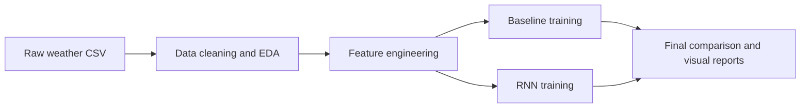

# Localized Climate Forecasting for Baroda

This repository is a college semester project focused on short-term weather forecasting for **Baroda, India**. It predicts:

- `temperature_2m`
- `precipitation`

for **24-hour**, **48-hour**, and **72-hour** horizons using:

- a compact baseline pipeline built around **Random Forest**
- a recurrent deep-learning pipeline built around **LSTM** and **GRU**

The project is designed for **local execution, report writing, and classroom presentation**. It is not intended as a deployment-ready production system.

## What The Project Includes

- cleaned hourly climate data preparation
- time-series feature engineering
- baseline vs deep-learning model comparison
- regression and extreme-event evaluation
- a simple local Streamlit dashboard for presentation

## Workflow



## Project Structure

| Path | Purpose |
| --- | --- |
| `main.py` | Simple command runner for the full workflow |
| `dashboard/streamlit_app.py` | Local presentation dashboard |
| `src/data_pipeline/` | Data cleaning and feature engineering code |
| `src/models/` | Baseline training, deep-learning training, and evaluation |
| `src/utils/` | Shared helpers for the local dashboard |
| `reports/` | Saved summaries, figures, and model-comparison tables |
| `docs/` | Project methodology and result interpretation |

## Setup

Create a virtual environment and install the dependencies:

```powershell
python -m venv venv
.\venv\Scripts\Activate.ps1
pip install -r requirements.txt
```

Before running the workflow, place the raw dataset at:

```text
data/raw/Baroda.csv
```

## Run The Project

Run the full workflow:

```powershell
python main.py all
```

Useful individual commands:

```powershell
python main.py prepare-data
python main.py train-baseline
python main.py train-rnn
python main.py evaluate
```

Older commands like `phase1` to `phase5` still work for backward compatibility, but the simplified commands above are the preferred interface.

## Open The Dashboard

After the reports are generated, launch the local dashboard:

```powershell
streamlit run dashboard/streamlit_app.py
```

## Result Snapshot

| Target | Horizon | Best model | Main observation |
| --- | --- | --- | --- |
| `temperature_2m` | `24h` | Random Forest | Strong short-range baseline with very high `R2` |
| `temperature_2m` | `48h` and `72h` | GRU | Sequence modeling helps at longer horizons |
| `precipitation` | `24h` and `48h` | GRU | Small regression gains over the baseline |
| `precipitation` | `72h` | Random Forest | Baseline stays competitive |
| Extreme precipitation | All horizons | No clear winner | Rare heavy-rain events remain difficult for both approaches |

## Documentation

- [Methodology](docs/METHODOLOGY.md)
- [Results](docs/RESULTS.md)

## Notes For Submission

- The saved outputs in `reports/` are meant to support a semester report or viva presentation.
- The dashboard is optional but useful for demonstrating the project cleanly on a laptop.
- The repository keeps the generated report folders from the original experimental workflow, but the public command surface has been simplified.
