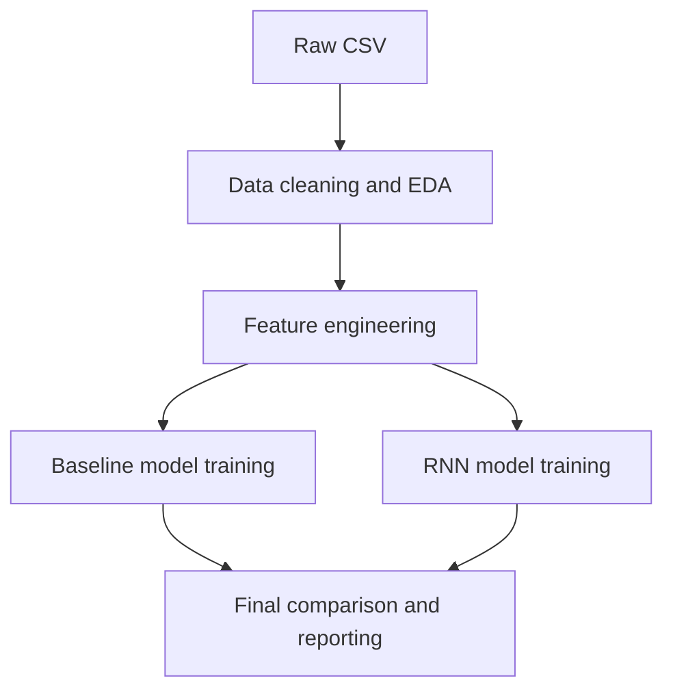

# Methodology

This project studies localized hourly weather forecasting for **Baroda, India**. The goal is to compare a compact machine-learning baseline against recurrent neural networks for short-term prediction.

## Problem Statement

The project forecasts two variables:

- `temperature_2m`
- `precipitation`

Each variable is predicted at:

- `24h`
- `48h`
- `72h`

## Dataset Summary

| Property | Value |
| --- | --- |
| Coverage | `2010-01-01 05:30:00` to `2024-02-21 04:30:00` |
| Cleaned rows | `123,936` |
| Cleaned variables | `19` |
| Frequency | Hourly |
| Missing timestamps after reindexing | `0` |
| Duplicate timestamps removed | `0` |

## End-To-End Workflow

## 1. Data Cleaning And EDA

Main tasks:

- parse timestamps safely
- convert time to `Asia/Kolkata`
- remove unnamed columns and duplicate timestamps
- reindex to a full hourly timeline
- generate summary statistics and basic visualizations

Saved outputs:

- cleaned dataset: `data/interim/Baroda_phase1_clean.csv`
- EDA summary: `reports/phase1/eda_summary.json`
- EDA figures: `reports/phase1/figures/`

Why it matters:

- local time is important for daily weather cycles
- conservative cleaning avoids removing rare but meaningful climate events

## 2. Feature Engineering

The cleaned hourly data is converted into a supervised forecasting table.

Feature groups:

| Feature type | Details |
| --- | --- |
| Calendar features | cyclical hour, weekday, month, and day-of-year signals |
| Wind direction encoding | sine and cosine transforms for circular direction values |
| Lag features | `1, 3, 6, 12, 24, 48, 72` hour lags |
| Rolling features | rolling means, standard deviations, and rainfall sums |
| Forecast targets | direct targets for `24h`, `48h`, and `72h` ahead |

Engineered dataset summary:

| Property | Value |
| --- | --- |
| Modeling rows | `123,792` |
| Boundary rows removed | `144` |
| Engineered features | `213` |
| Forecast targets | `6` |
| Train rows | `86,654` |
| Validation rows | `18,568` |
| Test rows | `18,570` |

Leakage prevention:

- chronological splitting is used instead of random shuffling
- rolling features are computed from shifted history only
- the scaler is fit on the training split only

## 3. Baseline Modeling

Candidate models:

- persistence baseline
- Random Forest regressor

Model selection rule:

- choose the best model per target family using the lowest average validation RMSE across the three forecast horizons

Why this step is useful:

- it gives a strong reference before using deep learning
- it makes the final comparison more honest and academically defensible

## 4. Recurrent Deep Learning

Candidate sequence models:

- LSTM
- GRU

Training setup:

| Parameter | Value |
| --- | --- |
| Sequence length | `72` hours |
| Hidden size | `48` |
| Layers | `1` |
| Batch size | `1024` |
| Max epochs | `6` |
| Patience | `2` |

Important design choices:

- only current weather variables and cyclical features are used as sequence inputs
- precipitation targets use `log1p` transformation
- rainy samples receive higher loss weight to handle imbalance

## 5. Final Evaluation

Regression metrics:

- RMSE
- MAE
- `R2`

Extreme-event metrics:

- Precision
- Recall
- F1-score

Extreme thresholds:

- temperature: `39.226 deg C`
- precipitation: `3.4 mm`

These thresholds are taken from the training split only, which avoids information leakage during evaluation.

## Strengths

- chronological train, validation, and test design
- baseline-first modeling strategy
- clear comparison between classical ML and deep learning
- report-ready saved tables and visuals

## Limitations

- rare heavy-rain events are still missed by both model families
- the raw dataset is expected locally and is not bundled into the tracked repository
- this repository is organized for academic demonstration rather than production deployment
