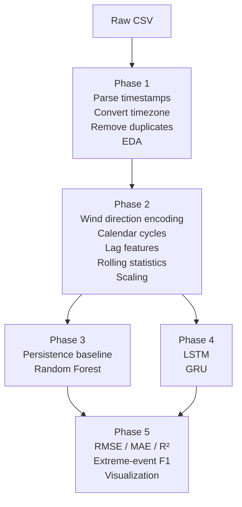

# Methodology

This document explains the academic workflow used to build the localized micro-climate forecasting system.

## Problem Framing

The project is designed around **direct multi-horizon forecasting** for two meteorological targets:

- `temperature_2m`
- `precipitation`

Forecasts are generated for:

- `t + 24h`
- `t + 48h`
- `t + 72h`

The dataset is an hourly localized weather time series for Baroda, India. The main scientific question is whether sequence-based deep learning can improve upon strong classical baselines for short-term climate adaptation use cases.

## Dataset Summary

| Property | Value |
| --- | --- |
| Temporal coverage | `2010-01-01 05:30:00` to `2024-02-21 04:30:00` |
| Cleaned rows | `123,936` |
| Cleaned variables | `19` |
| Frequency | Hourly |
| Missing timestamps after reindexing | `0` |
| Duplicate timestamps removed | `0` |

## End-to-End Pipeline

## Phase 1: EDA and Structural Cleaning

Objectives:

- Parse the raw dataset safely.
- Convert timestamps to `Asia/Kolkata`.
- Remove structural artifacts such as unnamed index columns.
- Check temporal regularity through hourly reindexing.
- Produce descriptive statistics and visual diagnostics.

Outputs:

- Cleaned dataset: `data/interim/Baroda_phase1_clean.csv`
- EDA summary: `reports/phase1/eda_summary.json`
- Figures: `reports/phase1/figures/`

Key design decisions:

- Local timezone conversion is important because diurnal cycles should be interpreted in local civil time.
- Conservative cleaning was used to avoid deleting rare meteorological extremes that are scientifically meaningful.

## Phase 2: Time-Series Feature Engineering

Objectives:

- Convert the cleaned hourly series into a supervised learning dataset.
- Encode cyclic temporal structure.
- Capture short- and medium-range temporal memory through lagged and rolling features.
- Build leakage-safe direct targets for 24h, 48h, and 72h forecasting.

Feature groups:

| Feature type | Details |
| --- | --- |
| Calendar cycles | Hour, weekday, month, and day-of-year sine/cosine encodings |
| Wind direction | Circular sine/cosine encoding for 10m and 100m wind direction |
| Lag features | `1, 3, 6, 12, 24, 48, 72` hour lags |
| Rolling statistics | Rolling means and standard deviations over `6, 24, 72` hours |
| Rolling sums | Precipitation and rain sums over `6, 24, 72` hours |

Engineered dataset summary:

| Property | Value |
| --- | --- |
| Supervised rows | `123,792` |
| Rows dropped at boundaries | `144` |
| Engineered features | `213` |
| Forecast targets | `6` |
| Train rows | `86,654` |
| Validation rows | `18,568` |
| Test rows | `18,570` |

Leakage prevention:

- Chronological splitting was used instead of shuffled sampling.
- Rolling features were computed on `shift(1)` data so they only use past values.
- The scaler was fit on the training split only.

## Phase 3: Baseline Modeling

Candidate models:

- Persistence baseline
- Random Forest regressor

Selection rule:

- Best model per target family chosen by the lowest **mean validation RMSE** across the three forecast horizons.

Why this phase matters academically:

- A forecasting project should never jump directly to LSTM or GRU without a meaningful baseline.
- Strong classical baselines often remain competitive, especially for structured environmental data.

## Phase 4: Deep Learning

Candidate recurrent models:

- LSTM
- GRU

Deep-learning setup:

| Parameter | Value |
| --- | --- |
| Sequence length | `72` hours |
| Hidden size | `48` |
| Number of layers | `1` |
| Batch size | `1024` |
| Max epochs | `6` |
| Patience | `2` |

Important methodological decisions:

- Only contemporaneous and cyclical features were used as sequence inputs so the recurrent models learn temporal memory directly.
- Precipitation targets used `log1p` transformation and rainy-event weighting to address strong skewness and zero inflation.

## Phase 5: Academic Evaluation

Regression metrics:

- RMSE
- MAE
- `R^2`

Event-detection metrics:

- Precision
- Recall
- F1-score

Extreme-event thresholds:

- Extreme heat: `39.226 °C`
- Extreme precipitation: `3.4 mm`

Thresholds were derived from the **training split only**, which is essential to avoid evaluation leakage.

## Research Strengths

- Strict chronological validation and testing
- Clear baseline-before-deep-learning progression
- Honest treatment of precipitation imbalance
- Reproducible outputs stored as versionable artifacts

## Known Limitations

- Heavy-rain events remain underdetected by both model families.
- There is no automated data ingestion or scheduled retraining pipeline yet.
