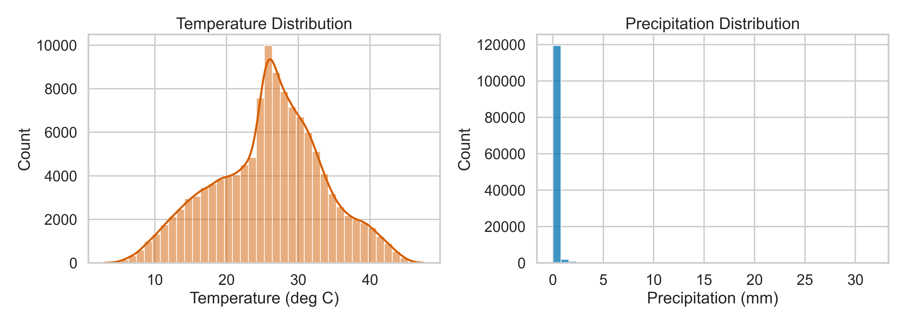
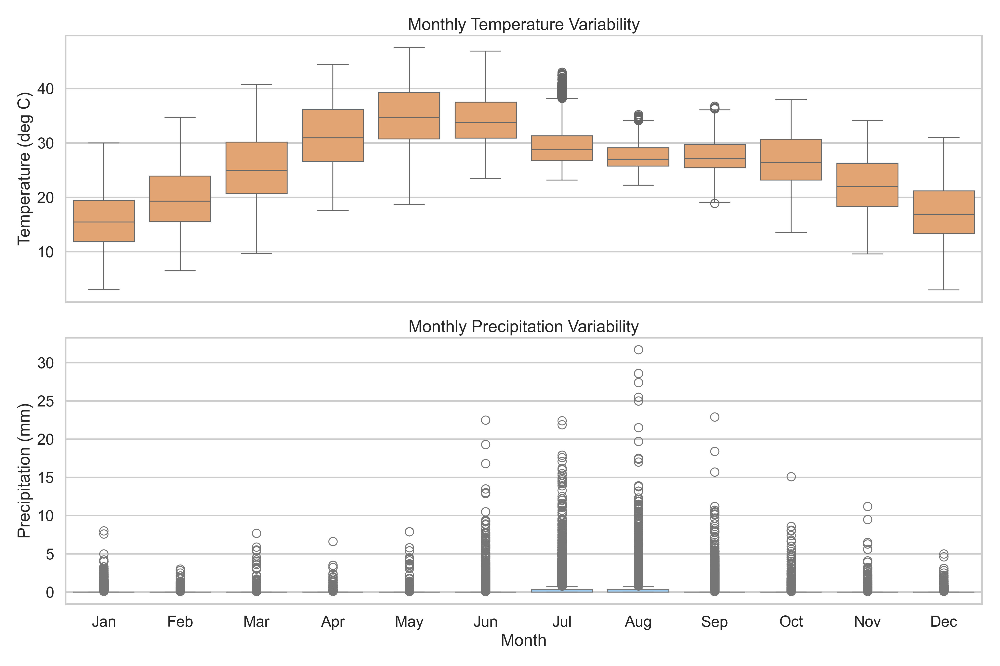
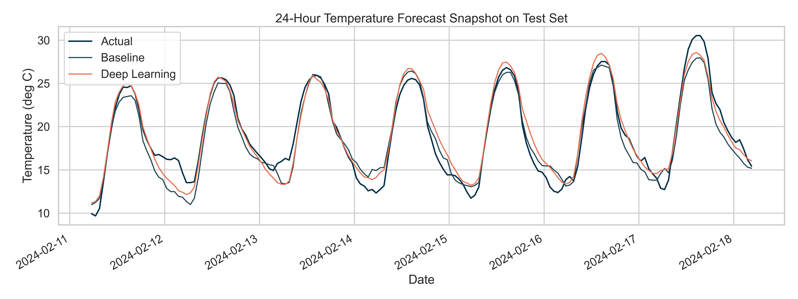
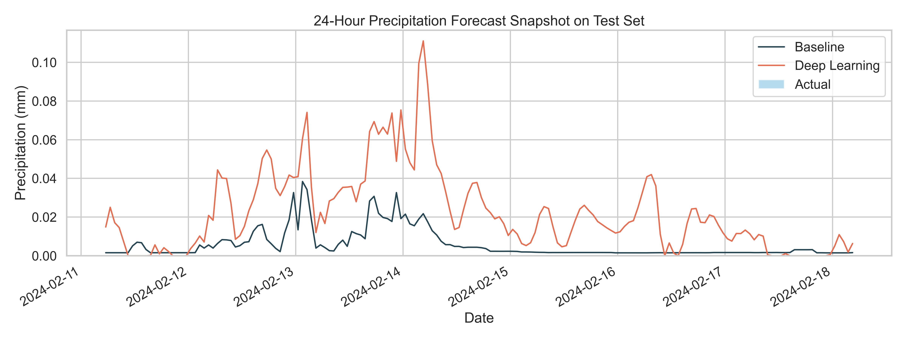

# Results and Visuals

This page consolidates the most important findings from the final evaluation stage and surfaces the most useful visuals for GitHub readers.

## Executive Summary

- **Random Forest** is the strongest short-horizon baseline for `temperature_2m`.
- **GRU** becomes stronger for `temperature_2m` at `48h` and `72h`.
- `precipitation` remains significantly harder than `temperature_2m` because the series is highly zero-inflated and extreme rainfall is rare.
- Under a strict heavy-rain threshold, **both model families miss the rarest extreme precipitation events**, which is a scientifically important limitation.

## Regression Results

| Target | Horizon | Best model | RMSE | MAE | R² |
| --- | --- | --- | ---: | ---: | ---: |
| `precipitation` | `24h` | GRU | `0.6242` | `0.1579` | `0.0707` |
| `precipitation` | `48h` | GRU | `0.6333` | `0.1767` | `0.0433` |
| `precipitation` | `72h` | Random Forest | `0.6353` | `0.1309` | `0.0337` |
| `temperature_2m` | `24h` | Random Forest | `1.5443` | `1.1323` | `0.9609` |
| `temperature_2m` | `48h` | GRU | `1.8183` | `1.3670` | `0.9457` |
| `temperature_2m` | `72h` | GRU | `2.0437` | `1.5426` | `0.9313` |

## Extreme-Event Results

| Target | Horizon | Best model | F1 | Precision | Recall |
| --- | --- | --- | ---: | ---: | ---: |
| `precipitation` | `24h` | Tie | `0.0000` | `0.0000` | `0.0000` |
| `precipitation` | `48h` | Tie | `0.0000` | `0.0000` | `0.0000` |
| `precipitation` | `72h` | Tie | `0.0000` | `0.0000` | `0.0000` |
| `temperature_2m` | `24h` | Random Forest | `0.8500` | `0.8863` | `0.8166` |
| `temperature_2m` | `48h` | GRU | `0.7987` | `0.8257` | `0.7735` |
| `temperature_2m` | `72h` | GRU | `0.7652` | `0.7857` | `0.7458` |

## Core Interpretation

### Temperature Forecasting

The temperature task is comparatively well behaved. Both model families perform strongly, but the recurrent GRU offers a measurable advantage at longer horizons, which suggests that sequential modeling helps capture medium-range temporal dependencies.

### Precipitation Forecasting

The precipitation task remains difficult. RMSE values look small because most hours are dry, but the event-detection evaluation reveals the real problem: rare heavy-rain events are not being captured under a strict thresholding scheme.

This is an academically valuable result because it shows why regression-only success can be misleading in imbalanced environmental forecasting problems.

## Data Understanding Visuals

### Target Overview

### Target Distributions

### Monthly Patterns

### Correlation Structure

## Final Model Comparison Visuals

### RMSE Comparison

### Extreme F1 Comparison

### Temperature Forecast Snapshot

### Precipitation Forecast Snapshot

## Practical Takeaways

- For explainable and strong short-horizon forecasting, the Random Forest baseline is already very competitive.
- For longer-horizon temperature forecasting, the GRU is the better final model.
- For extreme rainfall forecasting, the next research step should likely be a **two-stage precipitation system**:
  - wet-versus-dry event classification
  - conditional rainfall amount regression

## Suggested Thesis Discussion Angle

This project tells a strong academic story because it does not oversell deep learning. Instead, it demonstrates that:

- baseline models remain important,
- deep learning helps selectively rather than universally,
- and imbalance-aware evaluation can reveal limitations that headline regression metrics hide.
